# Diagramme de Classes - SGAOA (Système de Gestion Automatisé des Opérations d'Adoption)

## Description du Diagramme de Classes

Le diagramme de classes représente la structure statique du système en montrant les classes, leurs attributs, leurs méthodes et les relations entre elles. Ce diagramme est basé sur l'analyse des acteurs et des packages définis précédemment.

## Schéma du Diagramme de Classes

```mermaid
classDiagram
    %% Package Gestion des Utilisateurs
    class Utilisateur {
        -Long id
        -String nom
        -String prenom
        -String email
        -String motDePasse
        -String telephone
        -Role role
        -StatutCompte statut
        -boolean emailVerifie
        -LocalDateTime dateCreation
        -LocalDateTime dateModification
        -LocalDateTime dernierConnexion
        -String tokenVerificationEmail
        -String tokenReinitialisation
        -LocalDateTime expirationTokenReinitialisation
        
        +seConnecter(email, motDePasse) AuthResponse
        +sInscrire(inscriptionRequest) UtilisateurResponse
        +modifierProfil(informations) boolean
        +reinitialiserMotDePasse(email) boolean
        +verifierEmail(token) boolean
        +estActif() boolean
        +possedeRole(role) boolean
    }
    
    class Role {
        <<enumeration>>
        ADOPTANT
        PRESIDENT_COMITE
        SECRETAIRE
        AGENT_SOCIAL
        ADMINISTRATEUR
    }
    
    class StatutCompte {
        <<enumeration>>
        EN_ATTENTE_VALIDATION
        ACTIF
        INACTIF
        SUSPENDU
    }
    
    %% Package Gestion des Adoptants
    class Adoptant {
        -String profession
        -String adresse
        -String situationFamiliale
        -Integer nombreEnfants
        -String revenuMensuel
        -List~Document~ documents
        -List~DemandeAdoption~ demandes
        
        +soumettreDemande(demande) DemandeAdoption
        +deposerDocument(document) boolean
        +suivreEvolutionDossier() List~Etape~
        +recevoirNotification(message) void
        +payerFrais(montant) boolean
    }
    
    %% Package Gestion des Dossiers des Orphelins
    class Orphelin {
        -Long id
        -String nom
        -String prenom
        -LocalDate dateNaissance
        -String lieuNaissance
        -String sexe
        -String etatSante
        -String historiqueMedical
        -String situationFamiliale
        -List~Document~ documents
        -List~RapportSocial~ rapportsSociaux
        -StatutOrphelin statut
        
        +ajouterDocument(document) boolean
        +ajouterRapport(rapport) boolean
        +estDisponible() boolean
        +getAge() Integer
    }
    
    class StatutOrphelin {
        <<enumeration>>
        DISPONIBLE
        EN_PROCESSUS_ADOPTION
        ADOpte
        INDISPONIBLE
    }
    
    %% Package Gestion des Adoptions
    class DemandeAdoption {
        -Long id
        -String reference
        -LocalDate dateDepot
        -StatutDemande statut
        -String motifRejet
        -LocalDate dateDecision
        -Adoptant adoptant
        -Orphelin orphelin
        -List~EtapeAdoption~ etapes
        -List~Document~ documents
        -Paiement paiement
        
        +valider() boolean
        +rejeter(motif) boolean
        +ajouterEtape(etape) boolean
        +suivreProgression() List~Etape~
        +estComplete() boolean
    }
    
    class StatutDemande {
        <<enumeration>>
        EN_ATTENTE
        EN_INSTRUCTION
        ENQUETE_SOCIALE
        COMITE_EXAMEN
        APPROUVEE
        REJETEE
        COMPLETEE
    }
    
    class EtapeAdoption {
        -Long id
        -String nom
        -String description
        -LocalDate dateDebut
        -LocalDate dateFin
        -StatutEtape statut
        -Utilisateur responsable
        -String commentaires
        
        +demarrer() boolean
        +finaliser() boolean
        +estEnRetard() boolean
    }
    
    class StatutEtape {
        <<enumeration>>
        NON_DEMARREE
        EN_COURS
        TERMINEE
        EN_RETARD
    }
    
    %% Package Enquêtes Sociales & Rapports
    class EnqueteSociale {
        -Long id
        -LocalDate dateVisite
        -String lieuVisite
        -String rapportVisite
        -String conclusion
        -String recommandation
        -AgentSocial agentSocial
        -DemandeAdoption demande
        -List~Document~ photos
        -List~Document~ documents
        
        +realiserVisite() boolean
        +redigerRapport(rapport) boolean
        +ajouterPhotos(photos) boolean
        +validerEnquete() boolean
    }
    
    class AgentSocial {
        -String matricule
        -String specialite
        -String zoneIntervention
        -List~EnqueteSociale~ enquetes
        
        +planifierVisite(demande, date) EnqueteSociale
        +realiserEnquete(enquete) boolean
        +getEnquetesEnCours() List~EnqueteSociale~
    }
    
    %% Package Paiement
    class Paiement {
        -Long id
        -String reference
        -BigDecimal montant
        -LocalDate datePaiement
        -StatutPaiement statut
        -String modePaiement
        -String transactionId
        -Adoptant adoptant
        -DemandeAdoption demande
        
        +effectuerPaiement(montant, mode) boolean
        +confirmerPaiement(transactionId) boolean
        +genererRecu() String
        +estRegle() boolean
    }
    
    class StatutPaiement {
        <<enumeration>>
        EN_ATTENTE
        EFFECTUE
        ECHOUE
        REMBOURSE
    }
    
    %% Package Communication & Notifications
    class Notification {
        -Long id
        -String titre
        -String message
        -TypeNotification type
        -LocalDateTime dateEnvoi
        -StatutNotification statut
        -String destinataire
        -String canal
        
        +envoyer() boolean
        +marquerCommeLue() boolean
        +programmerEnvoi(date) boolean
    }
    
    class TypeNotification {
        <<enumeration>>
        EMAIL
        SMS
        PUSH
        CONVOCATION
        RAPPEL
        DECISION
    }
    
    class StatutNotification {
        <<enumeration>>
        EN_ATTENTE
        ENVOYE
        LU
        ERREUR
    }
    
    %% Package Reports & Statistiques
    class Rapport {
        -Long id
        -String titre
        -String type
        -LocalDate dateGeneration
        -String contenu
        -Utilisateur generePar
        -FormatRapport format
        
        +generer() boolean
        +exporter(format) File
        +programmerGeneration(date) boolean
    }
    
    class FormatRapport {
        <<enumeration>>
        PDF
        EXCEL
        WORD
        CSV
    }
    
    %% Package Documents
    class Document {
        -Long id
        -String nom
        -String type
        -String cheminFichier
        -Long taille
        -LocalDate dateDepot
        -String statut
        -Utilisateur deposePar
        
        +uploader(fichier) boolean
        +valider() boolean
        +telecharger() File
        +supprimer() boolean
    }
    
    %% Relations entre les classes
    Utilisateur "1" --> "0..1" Adoptant : est un
    Utilisateur "1" --> "0..1" AgentSocial : est un
    
    Adoptant "1" --> "0..*" DemandeAdoption : dépose
    Orphelin "1" --> "0..*" DemandeAdoption : concerne
    DemandeAdoption "1" --> "1" Paiement : a
    DemandeAdoption "1" --> "0..*" EtapeAdoption : contient
    DemandeAdoption "1" --> "0..*" EnqueteSociale : nécessite
    
    AgentSocial "1" --> "0..*" EnqueteSociale : réalise
    EnqueteSociale "1" --> "1" DemandeAdoption : porte sur
    
    Utilisateur "1" --> "0..*" Notification : reçoit
    Utilisateur "1" --> "0..*" Rapport : génère
    Utilisateur "1" --> "0..*" Document : dépose
    
    Orphelin "1" --> "0..*" Document : possède
    Adoptant "1" --> "0..*" Document : possède
    DemandeAdoption "1" --> "0..*" Document : inclut
    EnqueteSociale "1" --> "0..*" Document : contient
    
    %% Relations avec les énumérations
    Utilisateur --> Role
    Utilisateur --> StatutCompte
    Orphelin --> StatutOrphelin
    DemandeAdoption --> StatutDemande
    EtapeAdoption --> StatutEtape
    Paiement --> StatutPaiement
    Notification --> TypeNotification
    Notification --> StatutNotification
    Rapport --> FormatRapport
```

## Description Textuelle des Classes

### Package Gestion des Utilisateurs

#### Utilisateur
Classe mère représentant tous les utilisateurs du système avec authentification et gestion des rôles.

**Attributs principaux :**
- Informations personnelles (nom, prénom, email, téléphone)
- Informations de connexion (mot de passe hashé, tokens)
- Gestion du cycle de vie (dates, statuts)

**Méthodes clés :**
- `seConnecter()` : Authentification JWT
- `sInscrire()` : Création de compte
- `verifierEmail()` : Validation email

#### Role & StatutCompte
Énumérations pour la gestion des permissions et du cycle de vie des comptes.

### Package Gestion des Adoptants

#### Adoptant
Spécialise Utilisateur pour les personnes souhaitant adopter.

**Attributs spécifiques :**
- Situation professionnelle et familiale
- Documents et demandes associées
- Capacité financière

**Fonctionnalités :**
- Soumission et suivi des demandes
- Gestion des documents
- Paiement des frais

### Package Gestion des Dossiers des Orphelins

#### Orphelin
Représente les enfants adoptables avec leur profil complet.

**Attributs :**
- Identité et état civil
- Historique médical et social
- Documents administratifs

**Fonctionnalités :**
- Gestion des documents
- Suivi de la disponibilité

### Package Gestion des Adoptions

#### DemandeAdoption
Classe centrale du système orchestrant le processus d'adoption.

**Cycle de vie :**
- Dépôt → Instruction → Enquête → Comité → Décision

**Fonctionnalités :**
- Validation/rejet
- Suivi des étapes
- Gestion des documents

#### EtapeAdoption
Décompose le processus en étapes traçables avec responsables et délais.

### Package Enquêtes Sociales & Rapports

#### EnqueteSociale & AgentSocial
Gèrent les évaluations sociales menées par les professionnels.

**Processus :**
- Planification des visites
- Rédaction des rapports
- Recommandations

### Package Paiement

#### Paiement
Gère les transactions financières sécurisées avec intégration système tiers.

**Fonctionnalités :**
- Traitement multi-modes
- Génération de reçus
- Suivi des statuts

### Package Communication & Notifications

#### Notification
Système de communication multi-canaux (email, SMS, push).

**Types :**
- Convocations
- Rappels
- Décisions
- Informations

### Package Reports & Statistiques

#### Rapport
Génération de rapports et tableaux de bord pour l'aide à la décision.

**Formats :**
- PDF, Excel, Word, CSV
- Programmation possible

### Package Documents

#### Document
Gestion centralisée des documents avec validation et traçabilité.

**Fonctionnalités :**
- Upload sécurisé
- Validation administrative
- Gestion des versions

## Héritage et Relations

### Relations d'Héritage
- `Adoptant` hérite de `Utilisateur`
- `AgentSocial` hérite de `Utilisateur`

### Relations d'Association
- **Un-à-plusieurs** : Adoptant → DemandesAdoption
- **Un-à-un** : DemandeAdoption → Orphelin
- **Plusieurs-à-plusieurs** : Documents (polymorphique)

### Relations de Dépendance
- Les packages transversaux (Notifications, Rapports) sont utilisés par tous les autres modules
- Le système de paiement est appelé par les demandes d'adoption

## Principes de Conception Appliqués

1. **Single Responsibility** : Chaque classe a une responsabilité unique
2. **Open/Closed** : Extensible via les énumérations et interfaces
3. **Dependency Inversion** : Les packages transversaux sont des abstractions
4. **Encapsulation** : Attributs privés avec accesseurs contrôlés
5. **Polymorphisme** : La classe Document est utilisée par plusieurs entités

Ce diagramme de classes constitue la base technique pour l'implémentation du système SGAOA.
